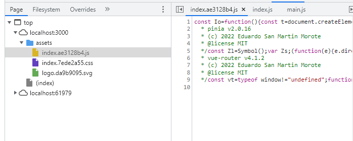

# vue3-debug-sourcemap

1. 默认打包没有sourcemap，将打包后的打包文件重命名为dist-safe
2. 运行项目
   ```bash
   cd dist-safe
   # 启动静态服务
   serve .
   ```
3. 打包开启sourcemap
    ```js
    export default defineConfig({
        // ...
        build: {
        	sourcemap: true,
        },
    });
    ```
4. 重新打包并运行
   ```bash
   cd dist
   serve .
   ```

5. 控制台观察源码

| dist-safe                                                    | dist                                                         |
| ------------------------------------------------------------ | ------------------------------------------------------------ |
|  |  |

6. 控制台添加sourcemap。需要找到dist-safe这个服务的map文件地址，这里是 `http://localhost:61979/assets/index.ae3128b4.js.map`

   

   


7. 添加成功

   

---

This template should help get you started developing with Vue 3 in Vite.

## Recommended IDE Setup

[VSCode](https://code.visualstudio.com/) + [Volar](https://marketplace.visualstudio.com/items?itemName=Vue.volar) (and disable Vetur) + [TypeScript Vue Plugin (Volar)](https://marketplace.visualstudio.com/items?itemName=Vue.vscode-typescript-vue-plugin).

## Customize configuration

See [Vite Configuration Reference](https://vitejs.dev/config/).

## Project Setup

```sh
npm install
```

### Compile and Hot-Reload for Development

```sh
npm run dev
```

### Compile and Minify for Production

```sh
npm run build
```

### Lint with [ESLint](https://eslint.org/)

```sh
npm run lint
```
